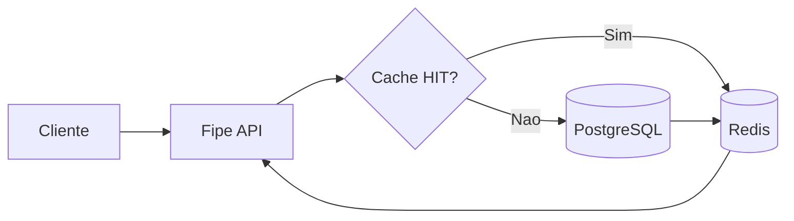

# Fipe Search + Redis

Projeto prático construído a partir do artigo do **DevSuperior** [**"Use REDIS para reduzir a Latência de APIs REST"**](https://devsuperior.com.br/blog/use-redis-para-reduzir-a-latencia-de-apis-rest).

A ideia central se mantém: Spring Boot, PostgreSQL como fonte de verdade e Redis na frente das leituras para desafogar o banco. Limitamos o pool de conexões do Postgres propositalmente para mostrar como o banco vira gargalo recebendo carga simultânea pesada.

De um lado você vai ver o Postgres gerando gargalo nas consultas e no pool de conexão, e de outro o Redis funcionando na prática lidando com `cache stampede`, `warm-up` e inspeção de dados em JSON! Tudo isso estimulado pelos testes de carga no [Grafana k6](https://grafana.com/docs/k6/latest/).

## O que muda em relação ao artigo?

- **Testes de carga integrados**: adicionamos cenários de concorrência com o `Grafana k6` via script orquestrador (`run_poc.sh`).
- **Mais legibilidade**: o cache deixou de usar serialização binária e passou para JSON, facilitando a leitura direta no `redis-cli` e na extensão _Redis for VS Code_.
- **Cenários extremos forçados**: 
  - O TTL foi reduzido para 6 segundos para forçar expirações rápidas e evidenciar o `stampede`.
  - A consulta ao banco ganhou um `pg_sleep(0.05)` (50ms) simulado.
  - O banco imita cenários de produção com `pool de conexão` limitado gerando gargalo.
  - Inserimos um processo de `warm-up` no startup das 5 chaves quentes.

## Fluxo de consulta



## Subindo a infraestrutura local

**Pré-requisitos:** Java 25, Docker e ambiente Bash (Git Bash, WSL, Linux ou macOS).

Suba os bancos (Postgres e Redis):
```bash
cd docker
docker compose up -d postgres redis
cd ..
```

Inicie a aplicação Spring Boot:
```bash
./mvnw spring-boot:run
```
*(No Windows via PowerShell, use `.\mvnw.cmd spring-boot:run`)*

## Rodando a POC da Live

Com a aplicação rodando, execute o script para aplicar a carga de `200` VUs por `20s` em 5 chaves quentes:

```bash
chmod +x ./run_poc.sh
./run_poc.sh
```

Isso recria os contêineres e atualiza os resultados no arquivo de log da POC.

**Resumo dos resultados de stress:**
| Cenário testado | RPS | p95 | Erros |
|---|---:|---:|---:|
| **Direct DB** (Gargalo do pool) | ~23k | 17.6ms | >1000 |
| **Cache c/ TTL curto** (Stampede) | ~23k | 17.7ms | >1300 |
| **Cache Aquecido** (Cenário Ideal) | ~29k | 16.6ms | **0** |

*O relatório atual demonstra que o ambiente aquecido entrega o melhor cenário — zero erros e pouquíssimos "misses".* Relatório completo: [`poc-results-live.md`](poc-results-live.md).

## Inspecionando o Redis

A chave de cache acompanha o padrão `fipe::modeloId:anoModelo`. Para checar no CLI:

```bash
redis-cli GET fipe::1:2023
```
Ou simplemente use o cliente do Redis para VS Code.
